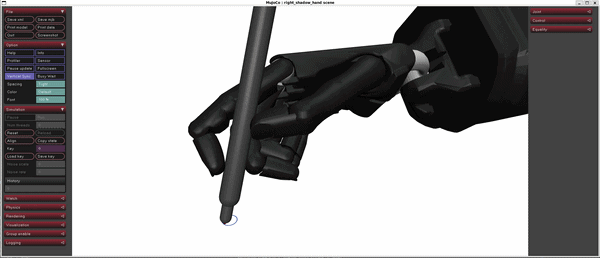

# dexterity_from_jacobian
Open-source implementation for paper: **Rapid Learning of Dexterous In-Hand Pen Writing through Real-Time Jacobian Estimation**
Main project website is at https://srl-ethz.github.io/rapid-dexterous-writing/

## Simulation-specific implementation details

Some elements from the original controller were simplified / modified for the MuJoCo implementation:

- Diagonal covariance matrix $diag(\mathbf p)$ is a constant scalar $P$
- Estimator regressor uses measured MuJoCo joint velocity instead of delta of commanded velocity
    - since we can get ground-truth noise-less joint data in simulation
- Initial excitation is random noise applied to predefined joint groups
    - difficult to set predefined postures to interpolate in simulation, where the hand-pen system can't be moved by (human) hand, so this random excitation method was applied
- Task-space command is P + feedforward velocity (I and D terms removed)
    - also no EMA filtering for the control output
- Task space controls all three dimensions, not just `XY`
- 500 Hz simulation, 50 Hz controller

## Installation

```bash
# make venv and activate it
python -m venv venv
source venv/bin/activate
pip install -r requirements.txt
```

## Run the MuJoCo controller
Draws a circle as a demo of the Jacobian dexterity controller.
The main code (`sim.py`) contains all code for the Shadow Hand demo and is kept deliberately minimal (< 400 loc), both as a demonstration of the controller's simplicity and to improve readability and extensibility.



```bash
# for Shadow Hand sample
python sim.py

# for Wuji Hand 2 sample
python sim_wuji_hand_2.py
```

        
## How to apply controller to new robot hand models

### making `scene_pen.xml`
Steps to make a scene in which the hand holds a pen, defined by a keyframe. The keyframe can be activated in the MuJoCo GUI with the `Key` slider in the upper right.

1. prepare your high-quality MJCF robot hand model which includes position actuators
1. make a tilted version of the model where the hand pose is set to a "writing" pose
    - e.g. `wuji_hand_2/right_tilted.xml`
    - unfortunately the `<attach>` feature cannot be used to load the model for our case, since it had some trouble with setting `qpos` keyframe fields for the attached model
1. create a new MJCF file which includes the tilted robot hand model and the pen body
    - e.g. `wuji_hand_2/scene_pen.xml`
    - uses the `<include>` feature to add the tilted model to the scene, which doesn't have the issue with keyframes
    - you can copy the `<body name="pen" ...` from that file for the pen model
1. set good-looking "writing" hand pose manually by adjusting the **Control** sliders in the MuJoCo GUI (ignore the pen for now)
    - once you're satisfied, "Copy state" from the GUI and fill in the `ctrl` fields for your keyframe
1. move the pen into the hand- the pen can be moved kinematically by pausing, double clicking the pen, and dragging it while pressing ctrl (right drag to rotate, left drag to move)
1. adjust the pen's grip in the hand (by going back and forth between modifying the **Control** sliders and pausing & moving the pen kinematically)
1. "Copy Pose" again and paste both the `ctrl` and `qpod` fields to your keyframe (don't copy the `time` field, the time is used to detect resets in the code), so that the robot and pen take the correct pose the moment the keyframe is loaded.

### make the controller script `sim_<your robot>.py`

1. make the sim script for your robot - use `sim_wuji_hand_2.py` as reference.
1. you may have try around a lot to adjust parameters like the robot & pen pose and control params until you get a combination that works- be patient!
    - robot hands with wrist DoFs (like the Shadow Hand) should generally have better performance for writing
